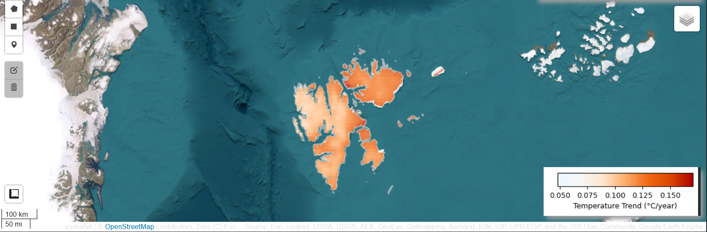

# **Climate Trends in Svalbard:** A 30-Year Temperature and Precipitation Analysis (1994–2023)

This repository presents a methodological workflow and visual analysis
of 30-year climate trends over Svalbard. The overarching goal of the
study focuses on temperature and precipitation dynamics by applying Sen
Slope estimator and the Mann Kendall trend test. The results are
presented using pixel-wise and aggregated methods.

This work was conducted at the Institute of Geography and Geology in
fulfillment of the requirements for the 5 ECTS module *Earth Observation
Cloud Computing* (Winter Semester 2025), as part of the Master's
programme *Applied Earth Observation and Geo analysis of the Living
Environment* at the University of Würzburg, Germany.

------------------------------------------------------------------------

**Author:** Murphy, Aoibhin\
**Course:** WS25 Cloud Computing in Remote Sensing (04-GEO-MET5)\
**Institution:** University of Würzburg

------------------------------------------------------------------------

### Why Svalbard?

Svalbard is a high-Arctic archipelago belonging to Norway and represents
a region of exceptional climatic importance. It is:

-   One of the fastest-warming regions on Earth, driven by Arctic
    amplification.

-   A key location for understanding global climate change processes.

-   Strategically important for long-term climate monitoring and
    research.

------------------------------------------------------------------------

## Data Overview

| **Dataset** | **Dataset Provider** | **Variable** | **Resolution** | **Time Period** | **Format** |
|------------|------------|------------|------------|------------|------------|
| **ERA5-Land Monthly Aggregated** | Copernicus Climate Change Service | 2m Air Temperature | \~11,132 m | 1994–2023 | GEE ImageCollection |
| **ERA5-Land Monthly Aggregated** | Copernicus Climate Change Service | Total Precipitation | \~11,132 m | 1994–2023 | GEE ImageCollection |
| **ArcticDEM (V4 Mosaic)** | University of Minnesota Polar Geospatial Center | Elevation (DEM) | \~2 m | 2012-2020 | GEE Image |
| **FAO GAUL (2015)** | Food and Agriculture Organization | Administrative Boundaries (Level 0) | Vector | 2015 | GEE FeatureCollection |

### Data Access and Citation

All data sources are freely available via the Google Earth Engines Data
Catalog and can be called on via the following GEE snippets.

**ERA5-Land:** `ee.ImageCollection("ECMWF/ERA5_LAND/MONTHLY_AGGR"`)

-   Citation: Muñoz Sabater, J., (2019): *ERA5-Land monthly averaged
    data from 1981 to present.* Copernicus Climate Change Service (C3S)
    Climate Data Store (CDS), [Accessed: 2026.04.10],
    <doi:10.24381/cds.68d2bb30>

**Adiminstrative Boundary Data:**
`ee.FeatureCollection("FAO/GAUL/2015/level0")`

-   Citation: The Global Administrative Unit Layers (GAUL) dataset,
    implemented by FAO within the CountrySTAT and Agricultural Market
    Information System (AMIS) projects, [Accessed: 2026.04.10].

**ArcticDEM:** `ee.Image("UMN/PGC/ArcticDEM/V4/2m_mosaic2")`

-   Citation: DEM(s) created by the Polar Geospatial Center from
    DigitalGlobe, Inc. imagery. Porter, Claire; Morin, Paul; Howat, Ian;
    Noh, Myoung-Jon; Bates, Brian; Peterman, Kenneth; Keesey, Scott;
    Schlenk, Matthew; Gardiner, Judith; Tomko, Karen; Willis, Michael;
    Kelleher, Cole; Cloutier, Michael; Husby, Eric; Foga, Steven;
    Nakamura, Hitomi; Platson, Melisa; Wethington, Michael, Jr.;
    Williamson, Cathleen; Bauer, Gregory; Enos, Jeremy; Arnold, Galen;
    Kramer, William; Becker, Peter; Doshi, Abhijit; D'Souza, Cristelle;
    Cummens, Pat; Laurier, Fabien; Bojesen, Mikkel, 2018, ArcticDEM,
    Harvard Dataverse, V1, [Accessed: 2026.04.10],
    [doi:10.7910/DVN/OHHUKH](https://doi.org/10.7910/DVN/OHHUKH)

------------------------------------------------------------------------

## Workflow

-   [1. Setup and Installation](#1-data-preparation)
    -   [1.1 Install Packages](#11-install-packages)
    -   [1.2 Import Required Libraries](#12-import-required-libraries)
    -   [1.3 Create Linkage between Notebook and Google Earth Engine](#13-create-linkage-between-notebook-and-google-earth-engine)
    -   [1.4 Create Linkage between Notebook and Google Drive](#14-create-linkage-between-notebook-and-google-drive)
    -   [1.5 Load Svalbard AOI](#15-load-svalbard-aoi)
    -   [1.6 Visualise Svalbard AOI](16-visualise-svalbard-aoi)
    -   [1.7 Load ERA5-Land Climate Data](#17-load-era5-land-climate-data)
    -   [1.8 Unit Conversion](#18-unit-conversion)
-   [2. Pixel-wise Trend Analysis](#2-pixel-wise-trend-analysis)
    -   [2.1 Annual Temperature Data](#21-annual-temperature-data)
        -   [2.1.1 Annual Temperature Trend Analysis](#211-annual-temperature-trend-anaylsis)
        -   [2.1.2 Visualisation](#212-visualisation)
        -   [2.1.3 OPTIONAL- Export as GeoTIFF](#213-optional-export-as-geotiff)
    -   [2.2 Annual Precipitation Data](#22-annual-precipitation-data)
        -   [2.2.1 Annual Precipitation Trend Analysis](#221-annual-precipitation-trend-analysis)
        -   [2.2.2 Visualisation](#222-visualisation)
        -   [2.2.3 OPTIONAL- Export as GeoTIFF](#223-OPTIONAL-export-as-geo-tiff)
    -   [2.3 Monthly Temperature Data](#23-monthly-temperature-data)
        -   [2.3.1 Monthly Temperature Trend Analysis](#231-monthly-temperature-trend-analysis)
        -   [2.3.2 Time Series Visualisation](#232-visualisation)
        -   [2.3.3 OPTIONAL- Export as GeoTIFF(12)](#233-OPTIONAL-export-as-geo-tiff(12))
    -   [2.4 Monthly Precipitation Data](#24-monthly-precipitation-data)
        -   [2.4.1 Monthly Precipitation Trend Analysis](#241-monthly-precipitation-trend-analysis)
        -   [2.4.2 Time Series Visualisation](#242-visualisation)
        -   [2.4.3 OPTIONAL - Export as GeoTIFF(12)](#243--OPTIONAL-export-as-geo-tiff(12))
    -   [2.5 Plotting Annual Precipitation and Temperature](#25plotting-annual-precipitation-and-temperature)
-   [3. Statistical Analysis](#3-statistical-analysis)
    -   [3.1 Mann–Kendall and Sen’s Slope: Temperature](31-mann-kendall-and-sen's-slope:-temperature)
        -   [4.1.1 Export and Visualisation](#311-export-and-visualisation)
    -   [3.2 Mann–Kendall and Sen’s Slope: Precipitation](#32-mann-kendall-and-sen's-slope:-temperature)
        -   [4.2.1 Export and Visualisation](#321-export-and-visualisation)
-   [4. Results](#4-results)
-   [5. Methodology Acknowledgement](#5-methodology-acknowledgement)

------------------------------------------------------------------------

## 1. Setup and Installation

### 1.1 Install Packages

``` python

!pip install pymannkendall      # Statistical Anaylsis
!pip install cartopy            # Creating a Map Inset
```

### 1.2 Import Required Libraries

``` python

import ee                             #Google Earth Engine
import geemap                         #Google Earth Engine
import pymannkendall as mk            #Statistical anaylsis
import pandas as pd                   #Data manipulation
import numpy as np                    #Data manipulation
from PIL import Image                 #Image processing
import imageio                        #Image processing
import matplotlib.pyplot as plt       #Visualization
import matplotlib as mpl              #Visualization
import os                             #Visualization
from io import BytesIO                #Visualization
import cartopy.crs as ccrs            #Visualization
import cartopy.feature as cfeature    #Visualization
from google.colab import drive        #Saving outputs to folder
```

### 1.3 Create Linkage between Notebook and Google Earth Engine

``` python

#Authenticate
ee.Authenticate() 


#Initialize with your project
geemap.ee_initialize(project="insert-your-GEE-project-name") 
```

### 1.4 Create Linkage between Notebook and Google Drive

**Linkage between notebook and your own Google Drive**

``` python

drive.mount('/content/drive')

# Replace with your own working directory 
wd = "/content/drive/MyDrive/CloudComputingOutputs/Svalbard_Figures" 

os.makedirs(wd, exist_ok=True)  # create if not existing

os.chdir(wd)
```

### 1.5 Load Svalbard AOI

``` python

# Load GAUL level 0 countries
countries = ee.FeatureCollection('FAO/GAUL/2015/level0')

# Filter Svalbard
svalbard = countries.filter(
    ee.Filter.eq('ADM0_NAME', 'Svalbard and Jan Mayen Islands'))

svalbard_geometry = svalbard.geometry()
```

### 1.6 Visualise Svalbard AOI

``` python

Map = geemap.Map(center=[78, 18], zoom=5)

#Add basemap
Map.add_basemap('HYBRID')

#Add Svalbard boundary layer
Map.addLayer(
    svalbard,
    {
        'color': '#00FFFF',  # Cyan color
        'fillColor': '00000000',  # Transparent fill
        'width': 3
    },
    'Svalbard Boundary',
    True,
    0.8
)

#Add layer control
Map.addLayerControl()


Map
```


### 1.6 Load ERA5-Land Climate Data

``` python

# Define time period
start_date = '1994-01-01' #Start of 1994 
end_date = '2023-12-31'   #End of 2023: 30 year total
                          

# 1. Load TEMPERATURE data (2m air temperature)
temperature_dataset = ee.ImageCollection('ECMWF/ERA5_LAND/MONTHLY_AGGR') \
    .filterDate(start_date, end_date) \
    .filterBounds(svalbard_geometry) \
    .select('temperature_2m')

temp_count = temperature_dataset.size().getInfo()


# 2. Load PRECIPITATION data (total precipitation)
precipitation_dataset = ee.ImageCollection('ECMWF/ERA5_LAND/MONTHLY_AGGR') \
    .filterDate(start_date, end_date) \
    .filterBounds(svalbard_geometry) \
    .select('total_precipitation_sum')

precip_count = precipitation_dataset.size().getInfo()
```

### 1.7 Unit Conversion

``` python

# Function to convert Kelvin to Celsius
def kelvin_to_celsius(image):
    celsius = image.subtract(273.15)
    return celsius.copyProperties(image, image.propertyNames())

# Function to convert meters to millimeters
def meters_to_mm(image):
    mm = image.multiply(1000)
    return mm.copyProperties(image, image.propertyNames())

# Apply conversions
temp_celsius = temperature_dataset.map(kelvin_to_celsius)
precip_mm = precipitation_dataset.map(meters_to_mm)
```

------------------------------------------------------------------------

## 2. Pixel-wise Trend Analysis

``` python

# Function to calculate yearly mean

def create_yearly_composite(year):
year = ee.Number(year)
year_start = ee.Date.fromYMD(year, 1, 1) 
year_end = ee.Date.fromYMD(year, 12, 31)


# TEMPERATURE: mean of all months in the year
yearly_temp = temp_celsius \
    .filterDate(year_start, year_end) \
    .mean() \
    .set('year', year) \
    .set('system:time_start', year_start.millis())
    

# PRECIPITATION: sum of all months in the year (total annual precipitation)
yearly_precip = precip_mm \
    .filterDate(year_start, year_end) \
    .sum() \
    .set('year', year) \
    .set('system:time_start', year_start.millis())
    

# Combine into single image
    return ee.Image.cat([yearly_temp, yearly_precip]) \
        .rename(['temperature', 'precipitation']) \ 
        #Two bands now called 'Temperature' amd 'Precipitation'
        .clip(svalbard) \
        .set('year', year)


# Create list of years
years = ee.List.sequence(1994, 2023)


# Create yearly image collection
yearly_data = ee.ImageCollection.fromImages(
    years.map(create_yearly_composite) # Using function created at start of cell
)

# count images in GEE collection and convert result to Python
year_count = yearly_data.size().getInfo() 
```

This step creates annual composites from the monthly ERA5-Land data for
the period 1994–2023. For each year, temperature was calculated as the
mean of all monthly values, while precipitation was computed as the sum
of monthly totals, representing annual accumulation. Both variables were
combined into a single multi-band image and clipped to the Svalbard
study area. The resulting images were stored in an ImageCollection,
where each image represents one year of climate data and retains
temporal metadata for subsequent trend analysis.

### 2.1 Annual Temperature Data

#### 2.1.1 Annual Temperature Trend Analysis

``` python
#TEMPERATURE

# Pixelwise: calculate linear trend for each pixel
def calculate_annual_trend(collection, band_name):

    # Add time band (years since 1994)
    def add_time_band(image):
        date = ee.Date(image.get('system:time_start'))
        years = date.difference(ee.Date('1994-01-01'), 'year')
        return image.addBands(ee.Image(years).rename('time').float())

    # Add time to all images
    collection_with_time = collection.map(add_time_band)

    # Linear regression
    linear_fit = collection_with_time.select(['time', band_name]) \
        .reduce(ee.Reducer.linearFit())

    # Extract slope (trend per year)
    slope = linear_fit.select('scale').clip(svalbard)

    return slope

# Calculate temperature trend
temp_annual_trend = calculate_annual_trend(yearly_data, 'temperature')
```

``` python

# Get statistics for temperature trend
temp_stats = temp_annual_trend.reduceRegion(
    reducer=ee.Reducer.minMax(),
    geometry=svalbard_geometry,
    scale=11132,
    maxPixels=1e9
).getInfo()

# for data visualisation, i.e., max and min ranges
temp_min = temp_stats['scale_min']
temp_max = temp_stats['scale_max']
```

To quantify long-term temperature changes, a pixel-wise linear trend
analysis was performed on the annual composites. A time band
representing years since 1994 was added to each image, allowing temporal
regression to be applied. Using the `ee.Reducer.linearFit()` function, a
linear model was fitted independently for each pixel across the time
series. The resulting slope represents the rate of temperature change
(°C per year) at each location, producing a map of warming trends across
Svalbard through time.

Lastly, minimum and maximum trend values were extracted from the
pixel-wise slope map to quantify the spatial range of temperature change
across Svalbard. This will then be used as value ranges for when we
visualise the trend analysis.

#### 2.1.2 Visualisation

``` python

#visualisation parameters
temp_vis_params = {
    "min": temp_min,
    "max": temp_max,
    "palette":        # palette will start with light blue/white to red (warming)
        ["#eef7fd",   # very subtle blue
        "#f7f7f7",    # white 
        "#fee6ce",    # light red
        "#fdae6b",    # moderate red
        "#f16913",    # strong red
        "#d94801",    # dark red
        "#b30000",]   # very dark red
}

# Center, zoom, and add basemap
Map_temp_annual = geemap.Map(center=[78, 18], zoom=5)
Map_temp_annual.add_basemap('HYBRID')

# Add annual temperature trend layer
Map_temp_annual.addLayer(
    temp_annual_trend,
    temp_vis_params,
    'Temperature Trend (°C/year)',
    True,
    1.0
)

# Add boundary layer
Map_temp_annual.addLayer(
    svalbard,
    {'color': '#FFFFFF', 'fillColor': '00000000', 'width': 2},
    'Svalbard',
    True,
    0.5
)
# Add colorbar legend
Map_temp_annual.add_colorbar(
    vis_params=temp_vis_params,
    label='Temperature Trend (°C/year)',
    orientation='horizontal',
    transparent_bg=True
)

Map_temp_annual.addLayerControl()

print(f" Color scale: {temp_min} to {temp_max} °C/year")

Map_temp_annual
```

**Cell output:**

## 

Pixel-wise Annual Temperature Trend Analysis for Svalbard (1994-2023)
visualised in Google Collab/ GEE.

#### 2.1.3 OPTIONAL: Export as GeoTIFF

In order to further visualize the pixel-wise annual temperature trend
analysis, it can be exported as a GeoTIFF to be applied in softwares
like QGIS, or Arc GIS Pro.

``` python
#TEMPERATURE

# Create export task
task_temp_trend = ee.batch.Export.image.toDrive(

    # Image with slope band
    image=temp_annual_trend,

    # Task name given in GEE
    description='Svalbard_Annual_Temperature_Trend',

    # Folder structure in Google Drive; does not need to pre exist
    folder='/content/drive/MyDrive/CloudComputingOutputs/Svalbard_Figures',
##-----------------------Replace with your own folderpath--------------------

    # File name
    fileNamePrefix='Svalbard_Temperature_Trend_1994_2023',

    # Region to export
    region=svalbard_geometry,

    # Pixel resolution
    scale=11132,

    # Coordinate system
    crs='EPSG:4326',

    # Fil format
    fileFormat='GeoTIFF',

    # Allow large exports
    maxPixels=1e13,)

# Finally, start task
task_temp_trend.start()

# Note: You will not see your exported .tiff in your google drive straight away.

# Earth Engine does NOT export immediately when you run the code.

# You will have to look at the Earth Engine task manager for the status of each export. See below:

print("See attached to check the status of your export: https://code.earthengine.google.com/tasks")
```

#### Check the Status of your export with the following code:

``` python

# How to check your export actually started?

print(task_temp_trend.status())

# Outputs incl: UNSUBMITTED, FAILED, READY, RUNNING, and COMPLETED.
```

#### Optional: Export Svalbard Boundary Layer as well

``` python

#First change svalbard_geometry into a feature collection for export
sval_feature_collection= ee.FeatureCollection(svalbard_geometry)

AOI_Export = ee.batch.Export.table.toDrive(
    collection= sval_feature_collection,
    description='SvalbardAOI',
    folder='CloudComputingOutputs/AOI',
    ##-----------------------Replace with your own folderpath--------------------
    fileNamePrefix='SvalbardAOI',
    fileFormat='SHP'
)

AOI_Export.start()
```

#### Example of QGIS Map Output:


### 2.2 Annual Precipitation Data

#### 2.2.1 Annual Precipitation Trend Analysis

``` python
#PRECIPITATION

# Calculate precipitation trend

precip_annual_trend = calculate_annual_trend(yearly_data, 'precipitation')

#Using function defined in section 2.1.1
```

``` python
#PRECIPITATION

# Get statistics for precipitation trend
precip_stats = precip_annual_trend.reduceRegion(
    reducer=ee.Reducer.minMax(),
    geometry=svalbard_geometry,
    scale=11132,
    maxPixels=1e9
).getInfo()

# for data visualisation, i.e., max and min ranges
precip_min = precip_stats['scale_min']
precip_max = precip_stats['scale_max']
```

#### 2.2.2 Visualisation

``` python
#PRECIPITATION

# Visualization parameters
precip_vis_params = {
    'min': precip_min,
    'max': precip_max,
    'palette': ['#8C510A', #Teal > less precipitation (drier)
                '#BF812D', 
                '#DFC27D', 
                '#F6E8C3',
                '#FFFFFF', 
                '#C7EAE5', 
                '#80CDC1', 
                '#35978F', 
                '#01665E'] #Blue > more precipitation (wetter)
}

# Center, zoom and add basemap
Map_precip_annual = geemap.Map(center=[78, 18], zoom=5)
Map_precip_annual.add_basemap('HYBRID')

# Add precipitation trend
Map_precip_annual.addLayer(
    precip_annual_trend,
    precip_vis_params,
    'Precipitation Trend (mm/year)',
    True,
    1.0
)

# Add boundary
Map_precip_annual.addLayer(
    svalbard,
    {'color': '#FFFFFF', 'fillColor': '00000000', 'width': 2},
    'Svalbard',
    True,
    0.5
)

# Add color bar
Map_precip_annual.add_colorbar(
    vis_params=precip_vis_params,
    label='Precipitation Trend (mm/year)',
    orientation='horizontal',
    transparent_bg=True
)

Map_precip_annual.addLayerControl()

Map_precip_annual
```

**Cell output:**


#### 2.2.3 OPTIONAL: Export as GeoTIFF

``` python
#PRECIPITATION

# Create export task
task_precip_trend_annual = ee.batch.Export.image.toDrive(

    # Image with slope band
    image=precip_annual_trend,

    # Task name given in GEE
    description='Svalbard_Annual_Precipitation_Trend',

    # Folder structure in Google Drive
    folder='/content/drive/MyDrive/CloudComputingOutputs/Svalbard_Figures',
##-----------------------Replace with your own folderpath--------------------


    # File name
    fileNamePrefix='Svalbard_Precipitation_Trend_1994_2024',

    # Region to export
    region=svalbard_geometry,

    # Pixel resolution
    scale=11132,

    # Coordinate system
    crs='EPSG:4326',

    # Fil format
    fileFormat='GeoTIFF',

    # Allow large exports
    maxPixels=1e13,)

# Finally, start task
task_precip_trend_annual.start()
```

``` python

#Check status

print(task_precip_trend_annual.status())
```

#### Example of QGIS Map Output:


### 2.3 Monthly Temperature Data

#### 2.3.1 Monthly Temperature Trend Analysis

``` python
#TEMPERATURE

month_names = ['January', 'February', 'March', 'April', 'May', 'June',
               'July', 'August', 'September', 'October', 'November', 'December']

#Calculate trend for a specific month across all years
def calculate_monthly_trend(month_number, variable):
   

    # Filter for this month only
    if variable == 'temperature':
        month_data = temp_celsius.filter(
            ee.Filter.calendarRange(month_number, month_number, 'month')
        )
    else:
        month_data = precip_mm.filter(
            ee.Filter.calendarRange(month_number, month_number, 'month')
        )

    # Add time band
    def add_time(image):
        date = ee.Date(image.get('system:time_start'))
        years = date.difference(ee.Date('1970-01-01'), 'year')
        return image.addBands(ee.Image(years).rename('time').float())

    month_with_time = month_data.map(add_time)

    # Select correct band name
    band = 'temperature_2m' if variable == 'temperature' else 'total_precipitation_sum'

    # Linear regression
    fit = month_with_time.select(['time', band]).reduce(ee.Reducer.linearFit())

    # Extract slope
    slope = fit.select('scale').clip(svalbard_geometry)

    return slope

# Calculate trends for all months (temperature)
temp_monthly_trends = {}
for month_num in range(1, 13): # There are 12 months, but still range to 13. In python, range inlcudes (start, stop) start is included, stop is not included. Therefore, 13 is not counted.
    
    temp_monthly_trends[month_num] = calculate_monthly_trend(month_num, 'temperature')
```

#### 2.3.2 Visualisation

#### Monthly Temperature Trends 1994-2023 Graph

.png){width="690"}

#### Code for graph can be found below:

``` python
#TEMPERATURE

# Month names for subplot titles
month_names = [
    "January", "February", "March", "April", "May", "June",
    "July", "August", "September", "October", "November", "December"
]

# Define a fixed lon/lat rectangle around Svalbard for consistent framing
region_geom = ee.Geometry.Rectangle(
    [8.0, 76.2, 36.0, 81.6],
    proj="EPSG:4326",
    geodesic=False
)

# Convert the region to coordinates for Earth Engine thumbnail export
region_coords = region_geom.getInfo()["coordinates"]


# Compute min, max, and mean for one monthly image over the study region
def get_month_stats(img, geom, scale=1000):
    valid = img.clip(geom)  # clip to Svalbard region

    minmax_dict = valid.reduceRegion(
        reducer=ee.Reducer.minMax(),
        geometry=geom,
        scale=scale,
        maxPixels=1e10,
        bestEffort=True
    ).getInfo()

    mean_dict = valid.reduceRegion(
        reducer=ee.Reducer.mean(),
        geometry=geom,
        scale=scale,
        maxPixels=1e10,
        bestEffort=True
    ).getInfo()

    # Keep only real numeric values from Earth Engine output
    vals = [float(v) for v in minmax_dict.values() if v is not None]
    mean_vals = [float(v) for v in mean_dict.values() if v is not None]

    vmin = min(vals) if vals else np.nan
    vmax = max(vals) if vals else np.nan
    vmean = mean_vals[0] if mean_vals else np.nan

    return valid, vmin, vmax, vmean


# Store the true pixel-level min/max from all 12 monthly maps
global_pixel_mins = []
global_pixel_maxs = []

# Loop through all 12 monthly trend rasters
for i in range(1, 13):
    base = temp_monthly_trends[i]
    valid = base.clip(region_geom)

    stats = valid.reduceRegion(
        reducer=ee.Reducer.minMax(),
        geometry=region_geom,
        scale=1000,
        maxPixels=1e10,
        bestEffort=True
    ).getInfo()

    # Keep only real numeric values from Earth Engine output
    vals = [float(v) for v in stats.values() if v is not None]

    if len(vals) >= 2:
        global_pixel_mins.append(min(vals))
        global_pixel_maxs.append(max(vals))
    elif len(vals) == 1:
        global_pixel_mins.append(vals[0])
        global_pixel_maxs.append(vals[0])

# Use fallback values only if stats could not be computed
true_global_min = min(global_pixel_mins) if global_pixel_mins else -0.06
true_global_max = max(global_pixel_maxs) if global_pixel_maxs else 0.44

# Round the display range to neat 0.02 steps for the colourbar
vis_min = float(np.floor(true_global_min / 0.02) * 0.02)
vis_max = float(np.ceil(true_global_max / 0.02) * 0.02)

# Print the true plotted range for checking
print(f"TRUE pixel minimum across all months: {true_global_min:.4f} °C/year")
print(f"TRUE pixel maximum across all months: {true_global_max:.4f} °C/year")
print(f"Rounded display range: {vis_min:.2f} to {vis_max:.2f} °C/year")


# Define the colour palette for the maps
temp_monthly_vis = {
    "min": vis_min,
    "max": vis_max,
    "palette": [
        "#eef7fd",   # very subtle blue
        "#f7f7f7",   # white near zero
        "#fee6ce",   # weak positive
        "#fdae6b",   # moderate positive
        "#f16913",   # strong positive
        "#d94801",   # stronger positive
        "#b30000"    # strongest positive
    ]
}


# Draw a simple outline of Svalbard to overlay on each map
outline = ee.Image().byte().paint(
    featureCollection=svalbard,
    color=1,
    width=2
)


# Lists to store rendered images and monthly statistics
images = []
month_minmax = []
month_mean = []

# Build monthly thumbnails and collect stats
for i in range(1, 13):
    base = temp_monthly_trends[i]

    valid, vmin_i, vmax_i, mean_i = get_month_stats(base, region_geom, scale=1000)

    vis_img = valid.visualize(**temp_monthly_vis).blend(
        outline.visualize(palette=["#5c5c5c"])
    )

    # Create a temporary download link (URL) from Earth Engine
    url = vis_img.getThumbURL({
        "region": region_coords,
        "dimensions": "1600x1200",
        "format": "png"
    })

    # Download the image from the URL into memory
    response = requests.get(url)
    response.raise_for_status()

    # Convert raw bytes into an image object for plotting
    image = Image.open(BytesIO(response.content)).convert("RGBA")

    images.append(image)
    month_minmax.append((vmin_i, vmax_i))
    month_mean.append(mean_i)


# Extract valid monthly summary numbers
valid_mins = [v[0] for v in month_minmax if not np.isnan(v[0])]
valid_maxs = [v[1] for v in month_minmax if not np.isnan(v[1])]
valid_means = [v for v in month_mean if not np.isnan(v)]

# Compute overall summary stats
overall_min = min(valid_mins) if valid_mins else np.nan
overall_max = max(valid_maxs) if valid_maxs else np.nan
overall_mean = float(np.mean(valid_means)) if valid_means else np.nan

# Identify strongest and weakest mean warming months
if valid_means:
    warmest_month_idx = int(np.nanargmax(month_mean))
    weakest_month_idx = int(np.nanargmin(month_mean))
else:
    warmest_month_idx = 0
    weakest_month_idx = 0

# Rank months from strongest to weakest mean warming
ranked = sorted(
    [(month_names[i], month_mean[i]) for i in range(12) if not np.isnan(month_mean[i])],
    key=lambda x: x[1],
    reverse=True
)


# Create the figure canvas
fig = plt.figure(figsize=(22, 12), facecolor="white")

# Create a 2x7 grid: 12 maps + 1 summary column
gs = fig.add_gridspec(
    nrows=2,
    ncols=7,
    width_ratios=[1.35, 1.35, 1.35, 1.35, 1.35, 1.35, 1.25],
    left=0.03,
    right=0.97,
    top=0.84,
    bottom=0.15,
    wspace=0.10,
    hspace=0.18
)

# Build the 12 monthly axes
axes = [fig.add_subplot(gs[r, c]) for r in range(2) for c in range(6)]

# Build the summary panel axis
summary_ax = fig.add_subplot(gs[:, 6])


# Draw each monthly panel
for i, ax in enumerate(axes):
    ax.set_facecolor("#fbfbfb")

    for spine in ax.spines.values():
        spine.set_visible(True)
        spine.set_edgecolor("#c9c9c9")
        spine.set_linewidth(1.2)

    # interpolation="nearest" keeps raster values sharp and avoids smoothing between pixels
    ax.imshow(images[i], interpolation="nearest")
    ax.set_xticks([])
    ax.set_yticks([])
    ax.set_aspect("auto")

    ax.set_title(month_names[i], fontsize=17, pad=8)

    vmin_i, vmax_i = month_minmax[i]
    stat_text = (
        f"min {vmin_i:.3f}\nmax {vmax_i:.3f} °C/yr"
        if not (np.isnan(vmin_i) or np.isnan(vmax_i))
        else "min/max unavailable"
    )

    ax.text(
        0.03, 0.04,
        stat_text,
        transform=ax.transAxes,
        ha="left",
        va="bottom",
        fontsize=10,
        color="#333333",
        bbox=dict(
            boxstyle="round,pad=0.25",
            fc="white",
            ec="#cfcfcf",
            alpha=0.95
        )
    )

# Create a matching matplotlib colormap for the colourbar
cmap = mpl.colors.LinearSegmentedColormap.from_list(
    "temp_trend_svalbard",
    temp_monthly_vis["palette"]
)

# Normalise colours to the same min/max used in the maps
norm = mpl.colors.Normalize(vmin=vis_min, vmax=vis_max)

# Create a long horizontal colourbar under the panels
cax = fig.add_axes([0.08, 0.09, 0.74, 0.022])

cbar = fig.colorbar(
    mpl.cm.ScalarMappable(norm=norm, cmap=cmap),
    cax=cax,
    orientation="horizontal"
)

# Add ticks every 0.04 so values are easy to read
ticks = np.arange(vis_min, vis_max + 0.001, 0.04)
cbar.set_ticks(ticks)
cbar.set_ticklabels([f"{t:.2f}" for t in ticks])

cbar.set_label("Temperature trend (°C per year)", fontsize=13)
cbar.ax.tick_params(labelsize=11)
cbar.outline.set_edgecolor("#bdbdbd")
cbar.outline.set_linewidth(1.2)


# Style the summary panel
summary_ax.set_facecolor("#fafafa")

for spine in summary_ax.spines.values():
    spine.set_visible(True)
    spine.set_edgecolor("#c9c9c9")
    spine.set_linewidth(1.2)

summary_ax.set_xticks([])
summary_ax.set_yticks([])
summary_ax.set_xlim(0, 1)
summary_ax.set_ylim(0, 1)

# Add summary title
summary_ax.text(
    0.07, 0.965,
    "Summary",
    fontsize=19,
    fontweight="bold",
    va="top"
)

# Build top-3 ranking text
top3_text = "\n".join(
    [f"{j+1}. {m} ({v:.3f})" for j, (m, v) in enumerate(ranked[:3])]
) if ranked else "Unavailable"

# Build full summary text block
summary_text = (
    f"Overall minimum trend:\n"
    f"{overall_min:.3f} °C/yr\n\n"
    f"Overall maximum trend:\n"
    f"{overall_max:.3f} °C/yr\n\n"
    f"Mean monthly trend:\n"
    f"{overall_mean:.3f} °C/yr\n\n"
    f"Strongest average warming:\n"
    f"{month_names[warmest_month_idx]} ({month_mean[warmest_month_idx]:.3f} °C/yr)\n\n"
    f"Weakest average warming:\n"
    f"{month_names[weakest_month_idx]} ({month_mean[weakest_month_idx]:.3f} °C/yr)\n\n"
    f"Top 3 warming months:\n"
    f"{top3_text}"
)

summary_ax.text(
    0.07, 0.88,
    summary_text,
    fontsize=12.5,
    va="top",
    color="#333333",
    linespacing=1.45
)


# Add main graph title
fig.suptitle(
    "Monthly Surface Temperature Trends across Svalbard (1994–2013)",
    fontsize=28,
    y=0.95
)

# Add subtitle slightly below the title to avoid overlap
fig.text(
    0.5, 0.905,
    "Monthly trend maps across the Svalbard archipelago; warmer colours indicate stronger positive trends.",
    ha="center",
    fontsize=14,
    color="#6a6a6a"
)


# Add a globe inset showing where Svalbard is located
ax_globe = fig.add_axes(
    [0.86, 0.18, 0.10, 0.10],
    projection=ccrs.Orthographic(15, 78)
)

ax_globe.set_global()
ax_globe.add_feature(cfeature.OCEAN, facecolor="#dbe9f6")
ax_globe.add_feature(cfeature.LAND, facecolor="#e8e6df")
ax_globe.coastlines(linewidth=0.5, color="gray")

# Mark Svalbard with a red point
svalbard_lon, svalbard_lat = 15.0, 78.0
ax_globe.plot(
    svalbard_lon,
    svalbard_lat,
    marker="o",
    markersize=5,
    color="red",
    transform=ccrs.PlateCarree()
)

# Label the point on the globe
ax_globe.text(
    svalbard_lon + 10,
    svalbard_lat - 3,
    "Svalbard",
    fontsize=7,
    transform=ccrs.PlateCarree()
)

# Save figure to working directory
plt.savefig("Svalbard_Monthly_Temp_Trends_1994_2013.png", dpi=400, bbox_inches="tight")

# Show the figure
plt.show()
```

#### 2.3.3 OPTIONAL- Export as GeoTIFF (12)

In order to further visualize the pixel-wise monthly temperature trend
analysis, it can be exported as a GeoTIFF to be applied in softwares
like QGIS, or Arc GIS Pro. The cell below will export all 12 months,
i.e., 12 GeoTIFFs into a specified folder.

``` python
#TEMPERATURE

month_names = ['January', 'February', 'March', 'April', 'May', 'June',
               'July', 'August', 'September', 'October', 'November', 'December']

# Export each month
for month_num in range(1, 13):
    month_name = month_names[month_num - 1]

    # Create export task
    task_temp_trend_monthly = ee.batch.Export.image.toDrive(
        # Image with monthly trend
        image=temp_monthly_trends[month_num],

        # Task name in GEE
        description=f'Svalbard_Temp_Monthly_{month_num:02d}_{month_name}',

        # Folder structure in Google Drive
        folder='CloudComputingOutputs/Monthly_Trends/Temperature',
##-----------------------Replace with your own folderpath--------------------

        # File name
        fileNamePrefix=f'Svalbard_Temp_Trend_{month_num:02d}_{month_name}_1994_2024',

        # Region to export
        region=svalbard_geometry,

        # Pixel resolution
        scale=11132,

        # Coordinate system
        crs='EPSG:4326',

        # File format
        fileFormat='GeoTIFF',

        # Allow large exports
        maxPixels=1e13
    )

    # Start the export
    task_temp_trend_monthly.start()
```

``` python
#Check export status

print(task_temp_trend_monthly.status())
```

### 2.4 Monthly Precipitation Data

#### 2.4.1 Monthly Precipitation Trend Analysis

``` python
#PRECIPITATION

# Calculate trends for all months (precipitation)
precip_monthly_trends = {}
for month_num in range(1, 13):
    
 # Calling on the 'calculate_monthly_trend' function created above
    precip_monthly_trends[month_num] = calculate_monthly_trend(month_num, 'precipitation') 
   
```

#### 2.4.2 Visualisation

#### Monthly Precipitation Trends 1994-2023 Graph


#### Code for graph can be found below:

``` python
#PRECIPITATION

# Month names for subplot titles
month_names = [
    "January", "February", "March", "April", "May", "June",
    "July", "August", "September", "October", "November", "December"
]

# Define a fixed lon/lat rectangle around Svalbard for consistent framing
region_geom = ee.Geometry.Rectangle(
    [8.0, 76.2, 36.0, 81.6],
    proj="EPSG:4326",
    geodesic=False
)

# Convert the region to coordinates for Earth Engine thumbnail export
region_coords = region_geom.getInfo()["coordinates"]


# Compute min, max, and mean for one monthly precipitation trend image. This will be used for statistic summary table
def get_month_stats(img, geom, scale=1000):
    clipped = img.clip(geom)  # clip to Svalbard region

    minmax_dict = clipped.reduceRegion(
        reducer=ee.Reducer.minMax(),
        geometry=geom,
        scale=scale,
        maxPixels=1e10,
        bestEffort=True
    ).getInfo()

    mean_dict = clipped.reduceRegion(
        reducer=ee.Reducer.mean(),
        geometry=geom,
        scale=scale,
        maxPixels=1e10,
        bestEffort=True
    ).getInfo()

    # Keep only real numeric values from Earth Engine output
    vals = [float(v) for v in minmax_dict.values() if v is not None]
    mean_vals = [float(v) for v in mean_dict.values() if v is not None]

    vmin = min(vals) if vals else np.nan
    vmax = max(vals) if vals else np.nan
    vmean = mean_vals[0] if mean_vals else np.nan

    return clipped, vmin, vmax, vmean

# Collect true pixel-level min/max across all 12 monthly precipitation trend maps
global_pixel_mins = []
global_pixel_maxs = []

for i in range(1, 13):
    base = precip_monthly_trends[i]
    clipped = base.clip(region_geom)

    stats = clipped.reduceRegion(
        reducer=ee.Reducer.minMax(),
        geometry=region_geom,
        scale=1000,
        maxPixels=1e10,
        bestEffort=True
    ).getInfo()

    vals = [float(v) for v in stats.values() if v is not None]

    if len(vals) >= 2:
        global_pixel_mins.append(min(vals))
        global_pixel_maxs.append(max(vals))
    elif len(vals) == 1:
        global_pixel_mins.append(vals[0])
        global_pixel_maxs.append(vals[0])

# Fallback values only used if stats fail
true_global_min = min(global_pixel_mins) if global_pixel_mins else -10.0
true_global_max = max(global_pixel_maxs) if global_pixel_maxs else 10.0

# Use a symmetric range around zero so white corresponds to zero
vis_abs = max(abs(true_global_min), abs(true_global_max))
vis_abs = float(np.ceil(vis_abs / 1.0) * 1.0)  # round outward to a neat whole number
vis_min = -vis_abs
vis_max = vis_abs

# Print the plotted range for checking
print(f"TRUE pixel minimum across all months: {true_global_min:.4f} mm/year")
print(f"TRUE pixel maximum across all months: {true_global_max:.4f} mm/year")
print(f"Symmetric display range: {vis_min:.2f} to {vis_max:.2f} mm/year")


# Brown = drying, white = near-zero trend, teal = wetting
precip_monthly_vis = {
    "min": vis_min,
    "max": vis_max,
    "palette": [
        '#8C510A', '#BF812D', '#DFC27D', '#F6E8C3',
        '#FFFFFF', '#C7EAE5', '#80CDC1', '#35978F', '#01665E'
    ]
}

# Simple Svalbard outline over the raster
outline = ee.Image().byte().paint(
    featureCollection=svalbard,
    color=1,
    width=2
)


# Lists to store rendered monthly images and summary stats
images = []
month_minmax = []
month_mean = []

# Build monthly thumbnails and collect stats
for i in range(1, 13):
    base = precip_monthly_trends[i]

    clipped, vmin_i, vmax_i, mean_i = get_month_stats(base, region_geom, scale=1000)

    # Render precipitation trend colours and draw the outline on top
    vis_img = clipped.visualize(**precip_monthly_vis).blend(
        outline.visualize(palette=["#5c5c5c"])
    )

    # Create temporary Earth Engine thumbnail URL using the same region-style as the temperature maps
    url = vis_img.getThumbURL({
        "region": region_coords,
        "dimensions": "1600x1200",
        "format": "png"
    })

    # Download the thumbnail into memory
    response = requests.get(url)
    response.raise_for_status()

    image = Image.open(BytesIO(response.content)).convert("RGBA")

    images.append(image)
    month_minmax.append((vmin_i, vmax_i))
    month_mean.append(mean_i)


# Extract valid monthly summary values
valid_mins = [v[0] for v in month_minmax if not np.isnan(v[0])]
valid_maxs = [v[1] for v in month_minmax if not np.isnan(v[1])]
valid_means = [v for v in month_mean if not np.isnan(v)]

# Compute overall summary values
overall_min = min(valid_mins) if valid_mins else np.nan
overall_max = max(valid_maxs) if valid_maxs else np.nan
overall_mean = float(np.mean(valid_means)) if valid_means else np.nan

# Identify strongest positive and strongest negative mean precipitation trends
if valid_means:
    wettest_month_idx = int(np.nanargmax(month_mean))
    driest_month_idx = int(np.nanargmin(month_mean))
else:
    wettest_month_idx = 0
    driest_month_idx = 0

# Rank months from strongest wetting to strongest drying
ranked = sorted(
    [(month_names[i], month_mean[i]) for i in range(12) if not np.isnan(month_mean[i])],
    key=lambda x: x[1],
    reverse=True
)


# Create figure canvas
fig = plt.figure(figsize=(22, 12), facecolor="white")

# Create a 2x7 grid: 12 maps + 1 summary column
gs = fig.add_gridspec(
    nrows=2,
    ncols=7,
    width_ratios=[1.35, 1.35, 1.35, 1.35, 1.35, 1.35, 1.25],
    left=0.03,
    right=0.97,
    top=0.84,
    bottom=0.15,
    wspace=0.10,
    hspace=0.18
)

# Monthly map axes
axes = [fig.add_subplot(gs[r, c]) for r in range(2) for c in range(6)]

# Summary axis
summary_ax = fig.add_subplot(gs[:, 6])


# Draw each monthly panel
for i, ax in enumerate(axes):
    ax.set_facecolor("#fbfbfb")

    for spine in ax.spines.values():
        spine.set_visible(True)
        spine.set_edgecolor("#c9c9c9")
        spine.set_linewidth(1.2)

    # interpolation="nearest"
    ax.imshow(images[i], interpolation="nearest")
    ax.set_xticks([])
    ax.set_yticks([])
    ax.set_aspect("auto")

    ax.set_title(month_names[i], fontsize=17, pad=8)

    vmin_i, vmax_i = month_minmax[i]
    stat_text = (
        f"min {vmin_i:.3f}\nmax {vmax_i:.3f} mm/yr"
        if not (np.isnan(vmin_i) or np.isnan(vmax_i))
        else "min/max unavailable"
    )

    ax.text(
        0.03, 0.04,
        stat_text,
        transform=ax.transAxes,
        ha="left",
        va="bottom",
        fontsize=10,
        color="#333333",
        bbox=dict(
            boxstyle="round,pad=0.25",
            fc="white",
            ec="#cfcfcf",
            alpha=0.95
        )
    )


# Create matching matplotlib colormap for the colorbar
cmap = mpl.colors.LinearSegmentedColormap.from_list(
    "precip_trend_svalbard",
    precip_monthly_vis["palette"]
)

# Use same min/max as the map rendering so the legend matches the maps
norm = mpl.colors.Normalize(vmin=vis_min, vmax=vis_max)

# Long horizontal colorbar under the monthly panels
cax = fig.add_axes([0.08, 0.09, 0.74, 0.022])

cbar = fig.colorbar(
    mpl.cm.ScalarMappable(norm=norm, cmap=cmap),
    cax=cax,
    orientation="horizontal"
)

# Tick spacing based on total range
tick_step = max(1, round((vis_max - vis_min) / 10))
ticks = np.arange(vis_min, vis_max + 0.001, tick_step)
cbar.set_ticks(ticks)
cbar.set_ticklabels([f"{t:.1f}" for t in ticks])

cbar.set_label("Precipitation trend (mm per year)", fontsize=13)
cbar.ax.tick_params(labelsize=11)
cbar.outline.set_edgecolor("#bdbdbd")
cbar.outline.set_linewidth(1.2)


# Style summary panel
summary_ax.set_facecolor("#fafafa")

for spine in summary_ax.spines.values():
    spine.set_visible(True)
    spine.set_edgecolor("#c9c9c9")
    spine.set_linewidth(1.2)

summary_ax.set_xticks([])
summary_ax.set_yticks([])
summary_ax.set_xlim(0, 1)
summary_ax.set_ylim(0, 1)

# Summary title
summary_ax.text(
    0.07, 0.965,
    "Summary",
    fontsize=19,
    fontweight="bold",
    va="top"
)

# Top 3 highest precipitating months text
top3_text = "\n".join(
    [f"{j+1}. {m} ({v:.3f})" for j, (m, v) in enumerate(ranked[:3])]
) if ranked else "Unavailable"

# Full summary text
summary_text = (
    f"Overall minimum trend:\n"
    f"{overall_min:.3f} mm/yr\n\n"
    f"Overall maximum trend:\n"
    f"{overall_max:.3f} mm/yr\n\n"
    f"Mean monthly trend:\n"
    f"{overall_mean:.3f} mm/yr\n\n"
    f"Strongest average precipitation:\n"
    f"{month_names[wettest_month_idx]} ({month_mean[wettest_month_idx]:.3f} mm/yr)\n\n"
    f"Strongest average dry period:\n"
    f"{month_names[driest_month_idx]} ({month_mean[driest_month_idx]:.3f} mm/yr)\n\n"
    f"Top 3 highest precipitation months s:\n"
    f"{top3_text}"
)

summary_ax.text(
    0.07, 0.88,
    summary_text,
    fontsize=12.5,
    va="top",
    color="#333333",
    linespacing=1.45
)


# Main title
fig.suptitle(
    "Monthly Precipitation Trends across Svalbard (1994–2023)",
    fontsize=28,
    y=0.95
)

# Subtitle
fig.text(
    0.5, 0.905,
    "Brown tones indicate decreasing precipitation, white indicates near-zero trend, and teal tones indicate increasing precipitation.",
    ha="center",
    fontsize=14,
    color="#6a6a6a"
)


# ArcticDEM inset in summary panel for topographic context
dem = ee.Image("UMN/PGC/ArcticDEM/V4/2m_mosaic").clip(region_geom)

dem_vis = dem.visualize(
    min=0,
    max=1200,
    palette=[
        "#1a9850",
        "#66bd63",
        "#a6d96a",
        "#d9ef8b",
        "#fee08b",
        "#fdae61",
        "#f46d43",
        "#d73027",
        "#f7f7f7"
    ]
)

dem_url = dem_vis.getThumbURL({
    "region": region_coords,
    "dimensions": "900x900",
    "format": "png"
})

response = requests.get(dem_url)
response.raise_for_status()
dem_img = Image.open(BytesIO(response.content)).convert("RGBA")

# DEM inset placement
ax_dem = fig.add_axes([0.845, 0.17, 0.11, 0.16])

# nearest keeps the DEM inset crisp instead of smoothing small terrain details
ax_dem.imshow(dem_img, interpolation="nearest")
ax_dem.set_xticks([])
ax_dem.set_yticks([])
ax_dem.set_aspect("auto")
ax_dem.set_title("Elevation", fontsize=10, pad=3)

for spine in ax_dem.spines.values():
    spine.set_edgecolor("#bdbdbd")
    spine.set_linewidth(1.0)

# Small vertical legend for DEM inset
dem_cmap = mpl.colors.LinearSegmentedColormap.from_list(
    "dem_cmap",
    [
        "#1a9850",
        "#66bd63",
        "#a6d96a",
        "#d9ef8b",
        "#fee08b",
        "#fdae61",
        "#f46d43",
        "#d73027",
        "#f7f7f7"
    ]
)

dem_norm = mpl.colors.Normalize(vmin=0, vmax=1200)

cax_dem = fig.add_axes([0.958, 0.17, 0.010, 0.16])

dem_cbar = fig.colorbar(
    mpl.cm.ScalarMappable(norm=dem_norm, cmap=dem_cmap),
    cax=cax_dem,
    orientation="vertical"
)

dem_cbar.set_label("m", fontsize=8)
dem_cbar.ax.tick_params(labelsize=7)
dem_cbar.set_ticks([0, 400, 800, 1200])
dem_cbar.outline.set_edgecolor("#bdbdbd")
dem_cbar.outline.set_linewidth(0.8)


# Save figure to working directory
plt.savefig("Svalbard_Monthly_Precip_Trends_1994_2023.png", dpi=400, bbox_inches="tight")

# Show figure
plt.show()
```

#### 2.4.3 OPTIONAL - Export as GeoTIFF (12)

``` python
#PRECIPITATION

month_names = ['January', 'February', 'March', 'April', 'May', 'June',
               'July', 'August', 'September', 'October', 'November', 'December']

# Export each month
for month_num in range(1, 13):
    month_name = month_names[month_num - 1]

    # Create export task
    task_precip_trend_monthly = ee.batch.Export.image.toDrive(
        # Image with monthly trend
        image=precip_monthly_trends[month_num],

        # Task name in GEE
        description=f'Svalbard_Precip_Monthly_{month_num:02d}_{month_name}',

        # Folder structure in Google Drive
        folder='CloudComputingOutputs/Monthly_Trends/Precipitation',
##-----------------------Replace with your own folderpath--------------------

        # File name
      fileNamePrefix=f'Svalbard_Precip_Trend_{month_num:02d}_{month_name}_1994_2024'

        # Region to export
        region=svalbard_geometry,

        # Pixel resolution
        scale=11132,

        # Coordinate system
        crs='EPSG:4326',

        # File format
        fileFormat='GeoTIFF',

        # Allow large exports
        maxPixels=1e13
    )

    # Start the export
    task_precip_trend_monthly.start()
```

#### 2.5 Plotting Annual Temperature and Precipitation

``` python
#TEMPERATURE AND PRECIPITATION

#Extract mean value for entire Svalbard
def extract_mean_value(image):

    stats = image.reduceRegion(
        reducer=ee.Reducer.mean(),
        geometry=svalbard_geometry,
        scale=11132,
        maxPixels=1e9
    )

    year = image.get('year')

    return ee.Feature(None, {
        'year': year,
        'temperature': stats.get('temperature'),
        'precipitation': stats.get('precipitation')
    })

# Extract values
svalbard_annual = yearly_data.map(extract_mean_value)
annual_data = svalbard_annual.getInfo()

# Convert to DataFrame
data_list = []
for feature in annual_data['features']:
    props = feature['properties']
    data_list.append({
        'year': props['year'],
        'temperature': props['temperature'],
        'precipitation': props['precipitation']
    })

df_annual = pd.DataFrame(data_list).sort_values('year').reset_index(drop=True)

#Plotting

fig, (ax1, ax2) = plt.subplots(2, 1, figsize=(14,10), sharex=True)

# Temperature plot
ax1.plot(df_annual['year'], df_annual['temperature'],
         marker='o', linewidth=2.5,
         markersize=7, color='darkred',
         label='Annual Mean Temperature')

# Trend line
temp_coef = np.polyfit(df_annual['year'], df_annual['temperature'], 1)
temp_trend = np.poly1d(temp_coef)

ax1.plot(df_annual['year'], temp_trend(df_annual['year']),
         linestyle='--', linewidth=2,
         color='black',
         label=f'Trend: {temp_coef[0]:.3f} °C/year')

ax1.set_ylabel('Temperature (°C)', fontsize=12, fontweight='bold')
ax1.set_title('Svalbard Annual Mean Temperature (1994–2023)',
              fontsize=14, fontweight='bold')

ax1.grid(True, linestyle='--', alpha=0.4)
ax1.legend()
ax1.set_facecolor('#f7f7f7')

# Precipitation
ax2.plot(df_annual['year'], df_annual['precipitation'],
         marker='s', linewidth=2.5,
         markersize=7, color='darkblue',
         label='Annual Total Precipitation')

# Trend line
prec_coef = np.polyfit(df_annual['year'], df_annual['precipitation'], 1)
prec_trend = np.poly1d(prec_coef)

ax2.plot(df_annual['year'], prec_trend(df_annual['year']),
         linestyle='--', linewidth=2,
         color='black',
         label=f'Trend: {prec_coef[0]:.2f} mm/year')

ax2.set_xlabel('Year', fontsize=12, fontweight='bold')
ax2.set_ylabel('Precipitation (mm)', fontsize=12, fontweight='bold')

ax2.set_title('Svalbard Annual Total Precipitation (1994–2023)',
              fontsize=14, fontweight='bold')

ax2.grid(True, linestyle='--', alpha=0.4)
ax2.legend()
ax2.set_facecolor('#f7f7f7')

# Save figure to working directory
plt.savefig("Svalbard_Temp_and_Precip_Plot_1994_2023.png", dpi=400, bbox_inches="tight")


plt.tight_layout()
plt.show()
```

#### Cell output from above:


------------------------------------------------------------------------

### 3. Statistical Analysis

This section presents the main statistical analysis used to quantify and
evaluate temporal trends in temperature and precipitation across
Svalbard. While earlier parts of the notebook focused on data
preparation, aggregation, and exploratory visualisation (e.g. annual
compositing and linear regression mapping), the core inferential
analysis is based on a combination of the Mann–Kendall test and Sen’s
slope estimator.

The Mann–Kendall test is a non-parametric statistical test used to
assess whether a monotonic trend exists in a time series, without
assuming a normal distribution of the data. Sen’s slope is a
complementary non-parametric estimator that quantifies the magnitude and
direction of that trend. Together, these methods provide a robust
framework for analysing environmental time series.

This code was based off of a Google Earth Engine Tutorial post. Please
visit the following site to learn more:
<https://developers.google.com/earth-engine/tutorials/community/nonparametric-trends>

The tutorial itself explains the core sequence: join the collection to
itself, compute the Mann–Kendall statistic by summing the signs across
all ordered pairs, estimate significance from the statistic and its
variance, and use that with Sen’s slope to quantify the trend magnitude.

**Note:** The code looks different from the tutorial because the
tutorial is written in Earth Engine JavaScript, whereas this notebook
uses Earth Engine Python in Colab. The underlying statistical workflow
is the same, but the syntax had to be altered to suit Colab
compatibility.

#### 3.1 Mann–Kendall and Sen’s Slope: Temperature

Pixelwise temperature trends were analysed using annual mean temperature
data derived from the `yearly_data` ImageCollection created earlier in
the notebook.

First, Sen’s slope was calculated for each pixel using the
`ee.Reducer.sensSlope()`. This provided an estimate of the rate of
temperature change (°C per year) across the study area. While this map
illustrates the spatial distribution and magnitude of temperature
trends, it does not indicate whether these trends are statistically
significant.

To address this, a pixelwise Mann–Kendall test was implemented using a
pairwise comparison approach adapted from the Earth Engine community
non-parametric trend analysis workflow (see URL at section 3). This
method evaluates all temporal pairs of observations at each pixel to
compute a Mann–Kendall test statistic and corresponding p-value.

The resulting p-value raster was then used to mask the Sen’s slope
image, retaining only pixels where trends are statistically significant
at the 5% level (`p < 0.05`).

The final map therefore shows both the **direction and magnitude of
temperature change**.

#### Sens Slope

``` python
#TEMPERATURE

# Function to calculate pixelwise Sen's slope
def calculate_sens_slope(collection, band_name):

    # Add time band (years since start of study period)
    def add_time_band(image):
        date = ee.Date(image.get('system:time_start'))
        time = date.difference(ee.Date('1994-01-01'), 'year')

        # Create a constant time band and match mask to the climate band
        time_band = ee.Image.constant(time) \
            .rename('time') \
            .float() \
            .updateMask(image.select(band_name).mask())

        return image.addBands(time_band)

    # Add time band to every image in the collection
    collection_with_time = collection.map(add_time_band)

    # Select bands in correct order for Sen's slope:
    # [time, climate variable]
    sens_input = collection_with_time.select(['time', band_name])

    # Apply Sen's slope reducer
    sens_result = sens_input.reduce(ee.Reducer.sensSlope())

    # Extract slope band and clip to study area
    slope = sens_result.select('slope').clip(svalbard)

    return slope

    # Get statistics for temperature Sen's slope
temp_sens_stats = temp_sens_slope.reduceRegion(
    reducer=ee.Reducer.minMax(),
    geometry=svalbard_geometry,
    scale=11132,
    maxPixels=1e9
).getInfo()

# Extract values
temp_sens_min = temp_sens_stats['slope_min']
temp_sens_max = temp_sens_stats['slope_max']

print(f"   Minimum: {temp_sens_min:.4f} °C/year")
print(f"   Maximum: {temp_sens_max:.4f} °C/year")

# Calculate pixelwise Sen's slope for temperature
temp_sens_slope = calculate_sens_slope(yearly_data, 'temperature')
```

#### Mann-Kendall

``` python
#TEMPERATURE

# Applying Man Kendall Signicance Test; then masking with Sens slope raster created in the above cell.

def mk_pvalue_image(collection):
    # Each image gets a list of all later images in an 'after' property
    joined = ee.ImageCollection(
        ee.Join.saveAll('after').apply(
            primary=collection,
            secondary=collection,
            condition=ee.Filter.lessThan(
                leftField='system:time_start',
                rightField='system:time_start'
            )
        )
    )

    # Define the sign of change between two images
    # +1 if later value > earlier value
    # -1 if later value < earlier value
    #  0 if equal

    def sign_pair(i, j):
        i = ee.Image(i)
        j = ee.Image(j)
        return j.neq(i).multiply(j.subtract(i).clamp(-1, 1)).int()

    # For each image, compare it to all later images
    def compare_after(current):
        current = ee.Image(current)
        after = ee.ImageCollection.fromImages(current.get('after'))
        return after.map(lambda img: sign_pair(current, img).unmask(0))

    # Sum all pairwise signs to get Mann–Kendall S
    S = (
        ee.ImageCollection(joined.map(compare_after).flatten())
        .reduce(ee.Reducer.sum(), 2)
        .rename('S')
    )

    # Approximate variance of S
    n = collection.size()
    varS = ee.Image.constant(
        ee.Number(n).multiply(ee.Number(n).subtract(1))
        .multiply(ee.Number(n).multiply(2).add(5))
        .divide(18)
    ).rename('varS')

    # Convert S to a Z-score
    z = (
        S.gt(0).multiply(S.subtract(1).divide(varS.sqrt()))
        .add(S.lt(0).multiply(S.add(1).divide(varS.sqrt())))
        .rename('z')
    )

  
    # Convert Z to a two-sided p-value
    p = ee.Image(2).multiply(
        ee.Image(1).subtract(
            ee.Image(0.5).multiply(
                ee.Image(1).add(z.abs().divide(ee.Image(2).sqrt()).erf())
            )
        )
    ).rename('p')

    return p

# Select annual temperature images for pixelwise Mann-Kendall
temp_coll = yearly_data.select('temperature').sort('system:time_start')

# Pixelwise MK p-value image
temp_mk_p = mk_pvalue_image(temp_coll).clip(svalbard)

# Significant pixels only
temp_sens_slope_sig = temp_sens_slope.updateMask(temp_mk_p.lt(0.05))

# Visualise
Map.addLayer(
    temp_mk_p,
    {'min': 0, 'max': 0.1, 'palette': ['red', 'white']},
    'Temperature MK p-value'
)

Map.addLayer(
    temp_sens_slope_sig,
    {'min': temp_sens_min, 'max': temp_sens_max, 'palette': ['blue', 'white', 'red']},
    "Temperature Sen's slope (p < 0.05)"
)

Map
```

#### 3.1.1 Export and Visualisation

``` python
#TEMPERATURE

# Create export task
task_temp_sens_slope_sig = ee.batch.Export.image.toDrive(
    
    # Image to export (Sen's slope result)
    image=temp_sens_slope_sig,

    # Task name in GEE Tasks tab
    description='temp_sens_slope_sig',

    # Folder in Google Drive (will be created if it doesn't exist)
    folder='CloudComputingOutputs/Svalbard_Figures',

    # Output filename
    fileNamePrefix='Svalbard_temp_sens_slope_sig_1994_2023',
##-----------------------Replace with your own folderpath--------------------

    # Export region 
    region=svalbard_geometry,

    # Spatial resolution 
    scale=11132,

    # Coordinate reference system
    crs='EPSG:4326',

    # Output format
    fileFormat='GeoTIFF',

    # Allow large exports
    maxPixels=1e13
)

# Start the export task
task_temp_sens_slope_sig.start()

print("GeoTiff with significant Sen's slope test export started: Temperature")
```

#### Example of QGIS Map Output:


#### 3.2 Mann–Kendall and Sen’s Slope: Precipitation

The same approach described in Section 3.1 was applied to precipitation
using the annual total precipitation data from the `yearly_data`
ImageCollection. Sen’s slope was first calculated pixelwise to estimate
the rate of change (mm per year), followed by a Mann–Kendall test to
assess statistical significance. The resulting p-value raster was used
to mask the Sen’s slope map (`p < 0.05`), ensuring that only
statistically significant precipitation trends were displayed. All
functions used in this step were defined previously and reused here for
consistency.

#### Sens Slope

``` python
#PRECIPITATION

precip_sens_slope = calculate_sens_slope(yearly_data, 'precipitation')

# Get statistics for precipitation Sen's slope
precip_sens_stats = precip_sens_slope.reduceRegion(
    reducer=ee.Reducer.minMax(),
    geometry=svalbard_geometry,
    scale=11132,
    maxPixels=1e9
).getInfo()

# Extract values
precip_sens_min = precip_sens_stats['slope_min']
precip_sens_max = precip_sens_stats['slope_max']

print("\n sen's slope Precipitation trend:")
print(f"   Minimum: {precip_sens_min:.4f} mm/year")
print(f"   Maximum: {precip_sens_max:.4f} mm/year")
```

#### Mann-kendall

``` python
#PRECIPITATION

# Applying Man Kendall Signicance Test; then masking with Sens slope raster created in the above cell.

# Select annual precipitation images
precip_coll = yearly_data.select('precipitation').sort('system:time_start')

# Pixelwise MK p-value image for precipitation
precip_mk_p = mk_pvalue_image(precip_coll).clip(svalbard)

# Mask Sen's slope so only significant pixels remain
precip_sens_slope_sig = precip_sens_slope.updateMask(precip_mk_p.lt(0.05))

# Visualise Mann-Kendall p-values
Map.addLayer(
    precip_mk_p,
    {'min': 0, 'max': 0.1, 'palette': ['red', 'white']},
    'Precipitation MK p-value'
)

# Visualise significant Sen's slope only
Map.addLayer(
    precip_sens_slope_sig,
    {'min': precip_sens_min, 'max': precip_sens_max, 'palette': ['brown', 'white', 'darkgreen']},
    "Precipitation Sen's slope (p < 0.05)"
)

Map
```

#### Output from above cell:

#### 3.1.1 Export and Visualisation

``` python

# Create export task
task_precip_sens_slope_sig = ee.batch.Export.image.toDrive(
    
    # Image to export (Sen's slope result)
    image=precip_sens_slope_sig,

    # Task name in GEE Tasks tab
    description='precip_sens_slope_sig',

    # Folder in Google Drive (will be created if it doesn't exist)
    folder='CloudComputingOutputs/Svalbard_Figures',
##-----------------------Replace with your own folderpath--------------------
 
    # Output filename
    fileNamePrefix='Svalbard_precip_sens_slope_sig_1994_2023',

    # Export region 
    region=svalbard_geometry,

    # Spatial resolution 
    scale=11132,

    # Coordinate reference system
    crs='EPSG:4326',

    # Output format
    fileFormat='GeoTIFF',

    # Allow large exports
    maxPixels=1e13
)

# Start the export task
task_precip_sens_slope_sig.start()

print("GeoTiff with significant Sen's slope test export started: Precipitation")
```

#### Example of QGIS Map Output:


## Results

### Temperature Trends

Temperature trends across Svalbard between 1994 and 2023 show a clear
and spatially consistent warming pattern. Sen’s slope results indicate
positive trends across nearly all land areas, generally ranging from
approximately 0.05°C to 0.20°C per year. The Mann–Kendall test
demonstrates that the vast majority of these trends are statistically
significant (p \< 0.05), with very few non-significant areas. Stronger
warming is observed in central and western regions, while slightly lower
but still positive trends occur in the north and east. Overall, the
results indicate that warming in Svalbard is widespread, consistent, and
statistically robust. However, these annual trend analyses do not
capture the strong seasonal variability evident in the monthly data. The
monthly trend maps show that warming is highly uneven throughout the
year, with substantially stronger trends during winter months
(particularly January and February) and much weaker trends during spring
and summer. This highlights that while the long-term warming signal is
clear, it is strongly influenced by seasonal dynamics that are not fully
represented in the annual aggregates.

### Precipitation Trends

Precipitation trends across Svalbard are more spatially variable and
less consistent than temperature trends. Sen’s slope analysis indicates
predominantly increasing precipitation, particularly in northern and
central regions, with maximum trends of approximately 7–8 mm per year.
However, the Mann–Kendall test shows that only a limited proportion of
these trends are statistically significant, with significant increases
mainly concentrated in the north, while large areas—especially in the
south—remain non-significant. Some localized areas also show weak or
slightly negative trends, although these are generally not significant.
Overall, precipitation changes appear more heterogeneous and less
statistically robust than temperature trends, indicating greater
variability and uncertainty. This variability is further reflected in
the monthly precipitation maps, which show considerable seasonal
fluctuation, with some months exhibiting increases and others showing
decreases or near-zero trends. These results suggest that precipitation
is influenced by more complex and variable processes, and that annual
aggregation may mask important short-term and seasonal dynamics.

# Methodological Acknowledgments

This study used ERA5-Land reanalysis data within [Google Earth
Engine]{.underline} to analyse climate trends over Svalbard. The
temperature variable (`temperature_2m`) represents near-surface air
temperature (\~2 m above ground), which may differ from actual surface
conditions in Arctic environments. The precipitation variable
(`total_precipitation_sum`) represents accumulated liquid and frozen
water (rain and snowfall) and is expressed as the equivalent depth of
water if distributed evenly over each grid cell; it excludes processes
such as fog and dew, meaning comparisons with observational data should
be interpreted with caution.

The pixelwise Mann–Kendall implementation was adapted from a [Google
Earth Engine]{.underline} JavaScript tutorial and translated into Python
for use in Colab. While the underlying statistical approach remains
consistent, the Python version represents a simplified implementation
and may introduce minor methodological differences.
